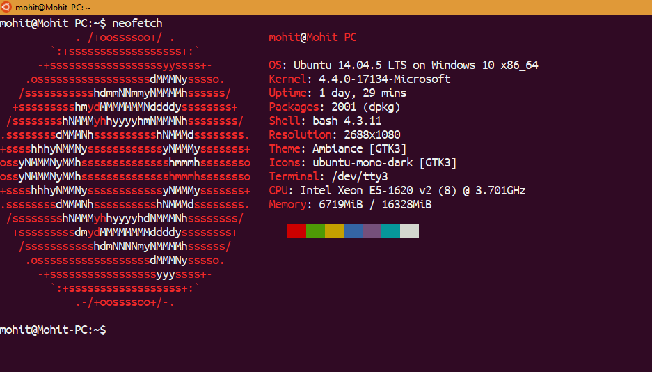
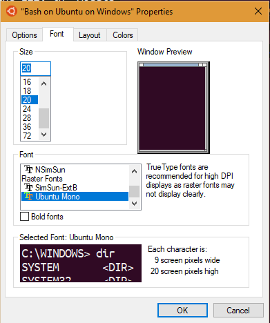
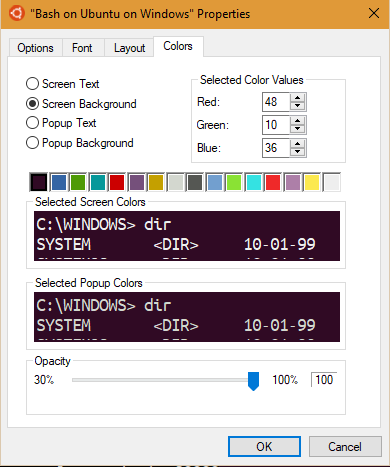

# Ubuntu on Bash on Windows 10
------------------------------

  

## Steps
---------
1. Download [Ubuntu Fonts](https://design.ubuntu.com/font/)
2. Unzip and install all Mono fonts, ``UbuntuMono-B.ttf``, ``UbuntuMono-BI.ttf``, ``UbuntuMono-R.ttf``, and ``UbuntuMono-RI.ttf``
3. Now in bash Ubuntu properties, Choose ``Font -> UbuntuMono``  
4. For colors, Setup the RGB values of 16 color boxes as follows:
    * Box 1: ``RGB: 48,10,36``
    * Box 2: ``RGB: 52,101,164``
    * Box 3: ``RGB: 78,154,6``
    * Box 4: ``RGB: 6,152,154``
    * Box 5: ``RGB: 204,0,0``
    * Box 6: ``RGB: 117,80,123``
    * Box 7: ``RGB: 196,160,0``
    * Box 8: ``RGB: 211,215,207``
    * Box 9: ``RGB: 85,87,83``
    * Box 10: ``RGB: 114,159,207``
    * Box 11: ``RGB: 138,226,52``
    * Box 12: ``RGB: 52,226,226``
    * Box 13: ``RGB: 239,41,41``
    * Box 14: ``RGB: 173,127,168``
    * Box 15: ``RGB: 252,233,79``
    * Box 16: ``RGB: 238,238,238``
    

  
  

    
## References
-------------

[1] [Make Bash on Ubuntu on Windows 10 Look Like the Ubuntu Terminal](https://medium.com/@jgarijogarde/make-bash-on-ubuntu-on-windows-10-look-like-the-ubuntu-terminal-f7566008c5c2)
  
  

