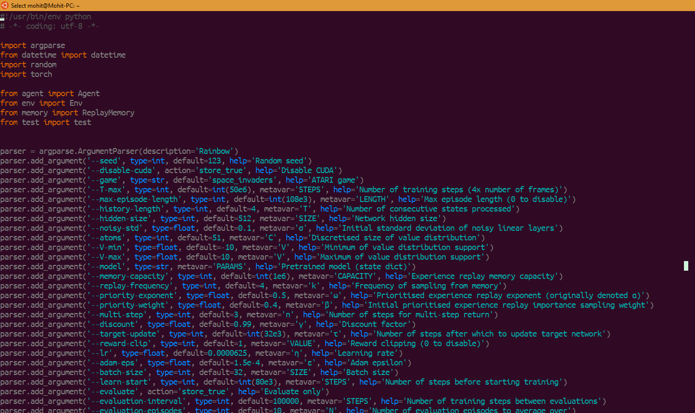

# Vim for Ubuntu/Linux/OSX
------------------------------

<p align="center">
  
</p>

## Steps
---------
1. `git clone https://github.com/altercation/solarized.git`
2. `mkdir -p ~/.vim/colors`
3. `cp solarized/vim-colors-solarized/colors/solarized.vim ~/.vim/colors/`
4. `vi ~/.vimrc`
```shell
syntax on 
if !has('gui_running') 
  let g:solarized_termtrans=1 
endif 
let g:solarized_termcolors=256 
set background=dark 
colorscheme solarized
```
    
## References
-------------

[1] [Solarized scheme for vim colours](https://github.com/altercation/vim-colors-solarized)

[2] [Use Solarized Color Scheme in OS X Terminal](https://xuri.me/2013/11/09/use-solarized-color-scheme-in-os-x-terminal.html)
  
  

